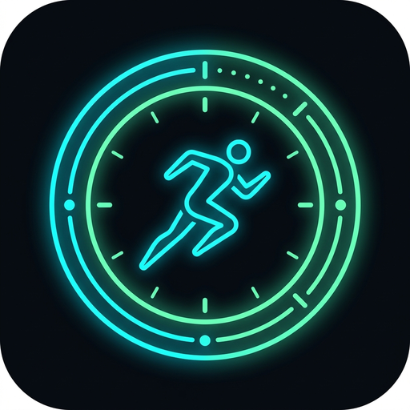
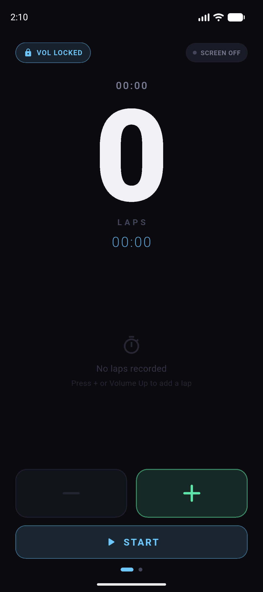
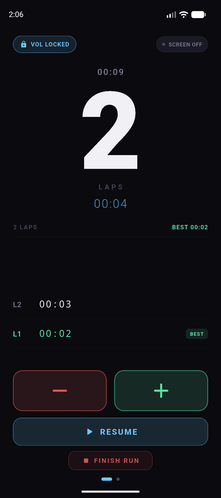
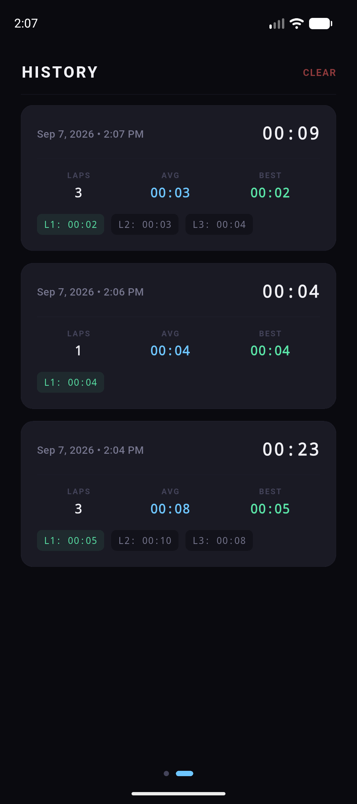

<div align="center">



# Lock Run Tracker

**A minimal, high-contrast lap tracker engineered for runners.**  
*Physical volume button control • Show over lock screen • AMOLED black design • Zero distractions.*

[](https://github.com/)
[](https://flutter.dev)
[](LICENSE)

</div>

---

## 📱 Screenshots

<div align="center">

| Idle Screen | Active Tracker / Paused | Workout History |
| :---: | :---: | :---: |
|  |  |  |

</div>

---

## ✨ Highlights & Features

- 🏃 **Physical Volume Button Lap Control**
  - **Volume Up**: Record a new lap instantly (auto-starts timer if idle).
  - **Volume Down**: Undo / delete last lap (restores elapsed time to the current lap).
  - No need to look at or touch the screen while sprinting or running in the rain.

- 🔒 **Show Over Lock Screen**
  - Uses native Android `FLAG_SHOW_WHEN_LOCKED` and `turnScreenOn`.
  - Your workout stays immediately accessible without having to unlock your phone with sweaty fingers.

- ⚡ **Minimalist AMOLED UI**
  - Pure `#0B0E14` pitch black background designed to save battery and reduce eye strain.
  - Giant **200px** hero lap counter that is crystal clear at arm's length.
  - Divided, high-contrast touch buttons: Green `+` for add lap, Red `−` for remove lap.

- ⏱️ **Intelligent In-Progress Lap Saving**
  - When finishing a workout, any remaining time on the current in-progress lap is automatically saved as the final lap (e.g., stopping on Lap 2 with 15s elapsed records 3 full laps in history).

- 📜 **1-Indexed Workout History**
  - Swipe horizontally between the live tracker and your workout history.
  - Detailed cards with total duration, total laps, average lap pace, best lap badge, and formatted splits (`L1`, `L2`, `L3`...).

- 🔊 **Quick Volume Toggle**
  - One-tap switch between **VOL LOCKED** (hijack volume keys for laps) and **VOL FREE** (standard phone volume adjustment).

---

## 📥 Download & Installation

### Option 1: Download Release APK
1. Download the latest `app-release.apk` from the [GitHub Releases](../../releases) section.
2. Open the APK file on your Android device.
3. If prompted, allow installation from unknown sources.
4. Open **Lock Run Tracker** and grant notification permission for background workout tracking.

---

## 🛠️ Building from Source

### Prerequisites
- [Flutter SDK](https://docs.flutter.dev/get-started/install) (version 3.12.0 or later)
- Android SDK (API Level 33+)
- Java 17+

### Steps
```bash
# 1. Clone the repository
git clone https://github.com/NimanthaShyamin/Counter_App.git
cd Counter_App

# 2. Install Flutter packages
flutter pub get

# 3. Build release APK
flutter build apk --release
```

The compiled release APK will be generated at:
```
build/app/outputs/flutter-apk/app-release.apk
```

---

## 🏗️ Architecture

- **Flutter (Dart)**: Clean Architecture with PageView navigation, custom animations (`CurvedAnimation`, `ScaleTransition`), and reactive state streams.
- **Android Native (Kotlin)**:
  - `RunTrackerService`: Foreground service with `MediaSessionCompat` for audio focus and lock-screen status notifications.
  - `MainActivity`: Direct physical hardware key interception (`KEYCODE_VOLUME_UP` / `KEYCODE_VOLUME_DOWN`) with debouncing.
- **Storage**: Lightweight, persistent local JSON storage via `shared_preferences`.

---

## 📄 License

This project is licensed under the MIT License - see the [LICENSE](LICENSE) file for details.
